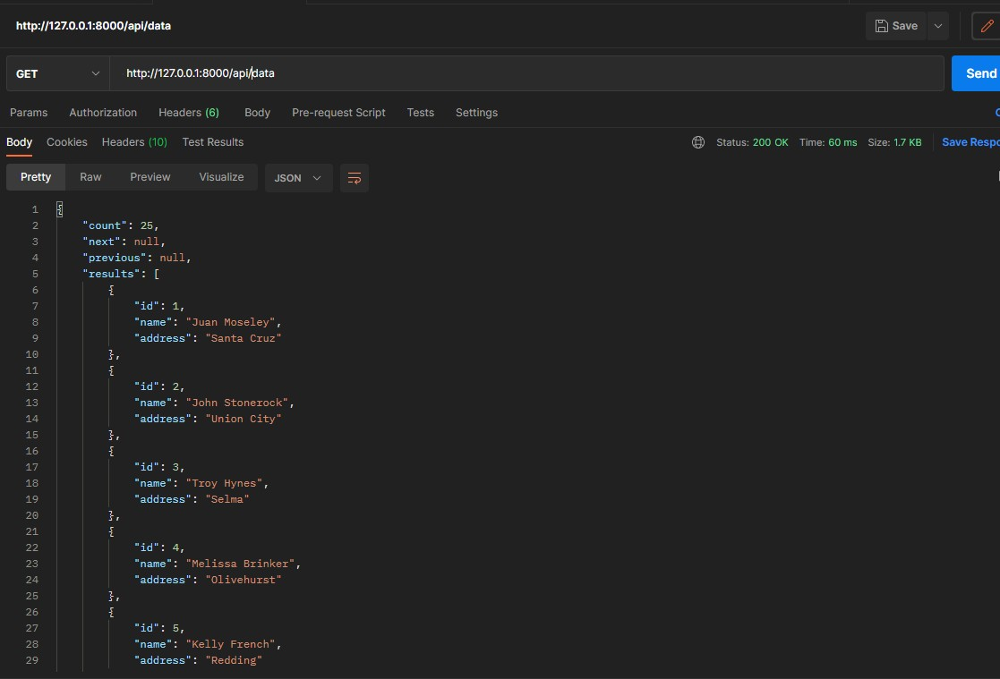
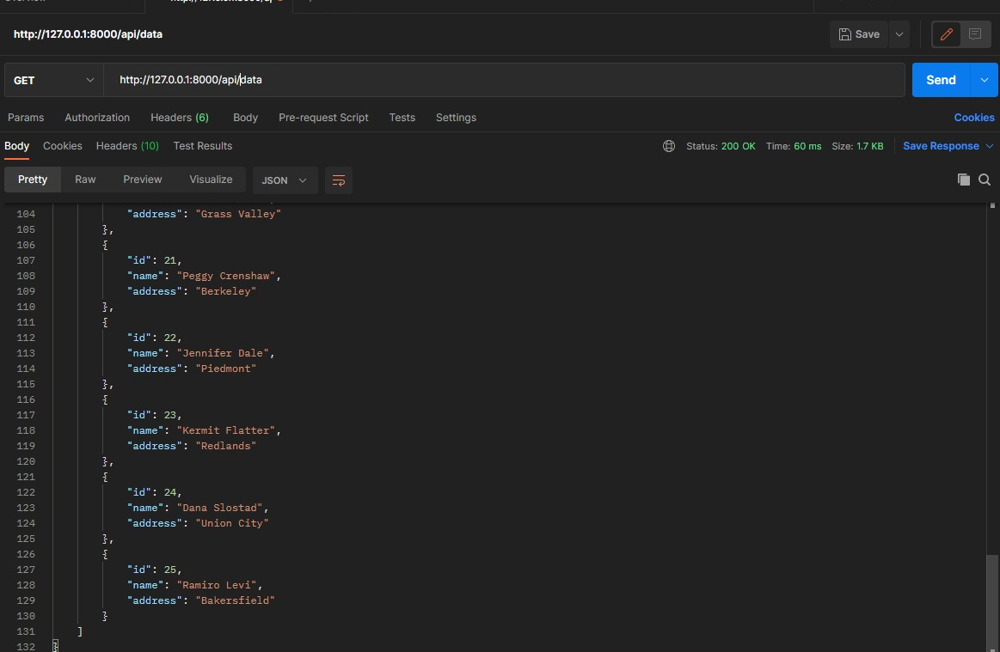

# REST API - Live Coding Interview
El reto consistia en crear una rest api que retornara un array con 25 objetos con id's diferentes. 

Al no saber que 'name' y 'body', asignarle a cada objeto, decidí usar las librerias 'names' y 'random_address' para generar nombres y direcciones 'random'

El resultado es el siguiente:

Como se puede observar en las imagenes, el programa genera 25 objetos con IDs diferentes y con nombre y cuerpos diferentes. 
También añadí una función para agregar más objetos al array sin borrar los objetos previos.
